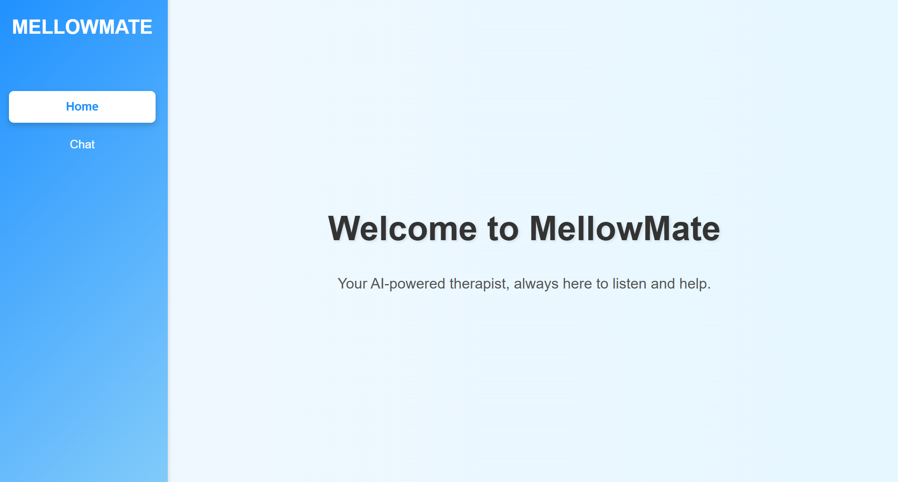
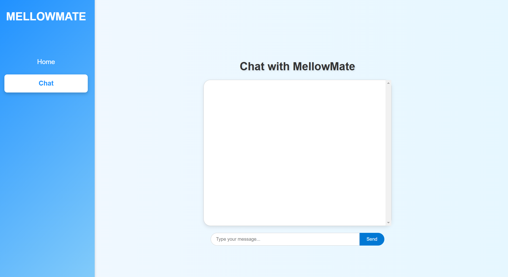

# MellowMate - AI-Powered Therapist Chat Application 💙

**MellowMate** is a next-generation AI-powered therapist designed to provide empathetic, real-time conversations tailored to Generation Z. Whether you're feeling down, need a boost, or just want someone to chat with, MellowMate is here to help. Leveraging cutting-edge AI technologies, MellowMate emulates a therapeutic experience, complete with iMessage-like chat formatting for an approachable, familiar feel.

---

## 🚀 Features

- **AI Therapist**: Empathetic conversations powered by OpenAI’s GPT, continuously fine-tuned to handle therapeutic responses.
- **iMessage-Inspired Chat UI**: An intuitive, minimalistic chat interface resembling Apple iMessage for a user-friendly experience.
- **Customizable Conversations**: Context-aware responses that adapt to the user’s needs in real-time.
- **Scalable Backend**: REST API powered by Django for efficient data flow and storage.
- **Accessibility First**: A responsive and inclusive UI built with React and CSS.

---

## 📸 Screenshots

### Home Page
The clean and welcoming home screen of MellowMate.  


---

### Chat Interface
Familiar iMessage-inspired layout for seamless interactions.  


---

## ⚙️ Tech Stack

### Frontend:
- **React**: Interactive, modern user interface.
- **TypeScript**: Static typing for robustness and better development workflows.
- **CSS**: Responsive design with emphasis on aesthetics and accessibility.

### Backend:
- **Django (REST Framework)**: API design for fast data processing and interactions.
- **SQLite**: Lightweight database for conversation history.

### AI Engine:
- **OpenAI GPT Model**: Pre-trained AI model continuously trained to emulate therapeutic responses.

---

## 🛠️ Installation & Setup

### Prerequisites:
- Node.js and npm installed
- Python 3.x installed

### Frontend Setup:
1. Clone this repository:
   ```bash
   git clone https://github.com/AryaanHabib/MellowMate.git
